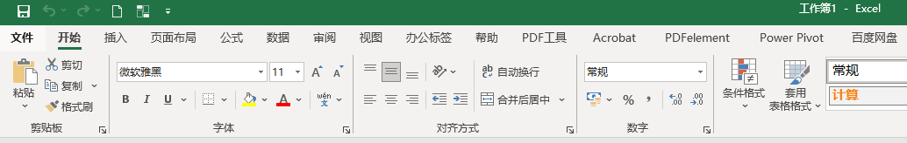
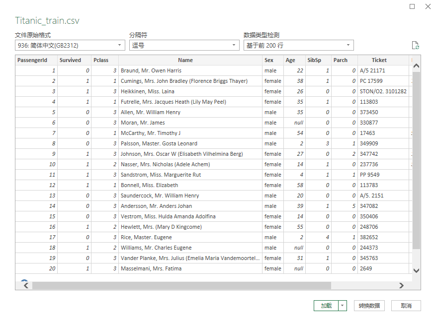
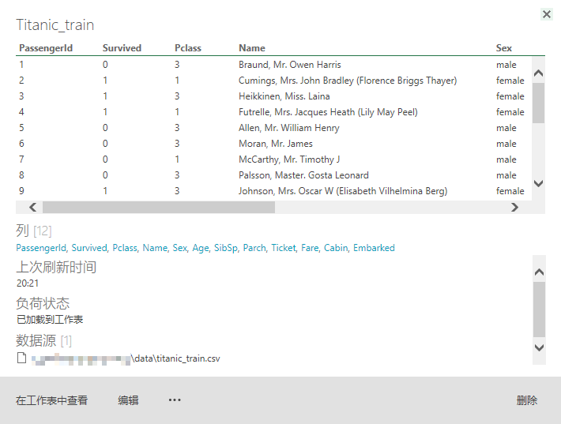
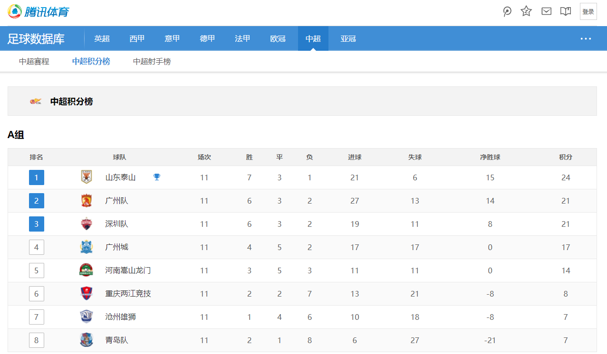

## 1. 数据缘何而来

Execel是我们常见的用来进行数据处理的工具，其中Excel文件主要包含有2种格式分别是`xls`或`xlsx`，`xls`和`xlsx`主要区别如下：

| xls                                   | xlsx                           |
| :------------------------------------ | ------------------------------ |
| 97-2003版                             | 2007之后版                     |
| 只能打开xls格式，无法直接打开xlsx格式 | 可以直接打开xls、xlsx格式      |
| 只有65536行、256列                    | 可以有1048576行、16384列       |
| 占用空间大                            | 占用空间小，运算速度也会快一点 |
因此，推荐大家使用最新版本的Excel或者WPS进行相关的学习与操作。

### 1.1 了解Excel

#### 1.1.1 文件

Excel文件包含两种数据文件，分别为文件结尾的`xls`和`xlsx`，`xls`文件为2003版以前版本创建，`xlsx`由2007版本以后创建，需要注意的是`xls`文件最大支持65536行，而`xlsx`文件最大支持1048576行。

每个数据文件叫做工作簿，每个工作簿里面含有多个工作表，每个工作表里面的格子叫做单元格。

#### 1.1.2 工具栏

* 文件：文件相关操作，导入、导出、文件加密等。
* 开始：单元格常用的操作集合。
* 插入：插入表格、图片、图表、文件、文本、符号等。
* 页面布局：用户表格主题以及打印页面设置。
* 公式：Excel所有的公式函数查询使用。
* 数据：数据排序、筛选、转换操作工具。
* 审阅：添加批注及数据工作表保护。
* 视图：窗口管理
* 帮助：帮助文档说明。
* 第三方插件：Excel增强插件。

### 1.2 从文件导入数据

Excel提供从文件导入到工作簿当中，支持`.txt`或`csv`文件，操作路径为菜单栏选择：**数据**-**获取和转换数据**-**从文件/CSV**。选择`data/`文件后进入预览框，预览框有三个参数供选择分别是：

* 文件原始格式：默认`936：简体中文（GB2312）`
* 分隔符：csv文件的分割符为`,`
* 数据类型检测：查看数据集的情况。

点击**加载**后可以看到我们导入的数据集，接着按快捷键`ctrl+s`保存工作簿到本地。

至此我们已经成功加载数据集到工作表当中，需要注意的是此时构建的数据表跟原始数据是存在连接关系，更改csv文件的数据后在点击路径：**设计-外部表数据-刷新**后就可以更新工作表数据。如果要取消链接关系则点击路径：**设计-外部数据表-取消链接**即可。

### 1.3 从网页导入数据

Excel可以从外部网页数据中获取表格数据，以中超积分榜数据为例，用浏览器访问`https://soccer.stats.qq.com/table.htm?type=zhongchao`查看表格数据。将网页表格数据导入到Excel只需要通过操作路径：**数据-自网站**，在URL里填入网页地址点击`确定`后待片刻就可以看到表格数据，选择`A组或B组`表格后点击加载，

图1.xxx.jpg

图1.xxx.jpg

### 任务

1. 使用`data/Titanic_train.txt`文件创建表格数据
2. 将工作簿文件`data/Titanic_test.xlsx`转为表格数据
3. 找任意一个有表格数据网站，将其数据导入到Excel当中

