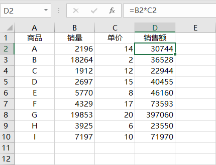
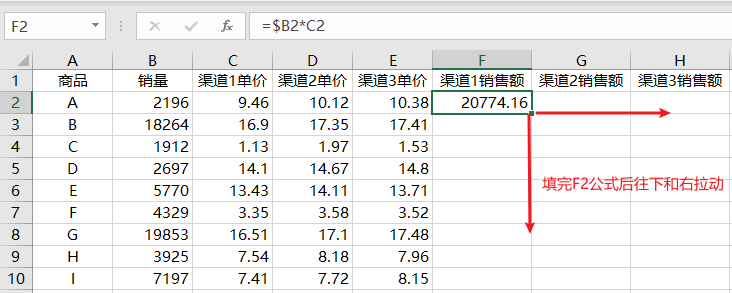
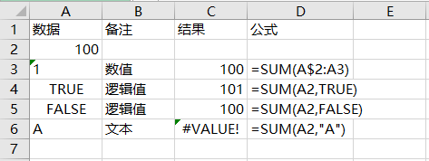
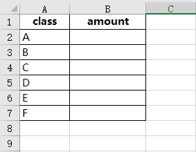
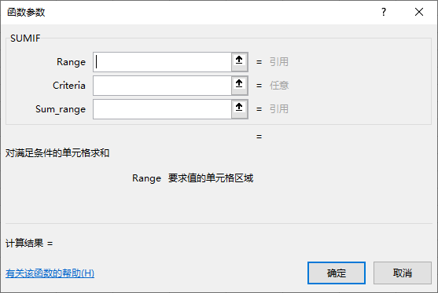
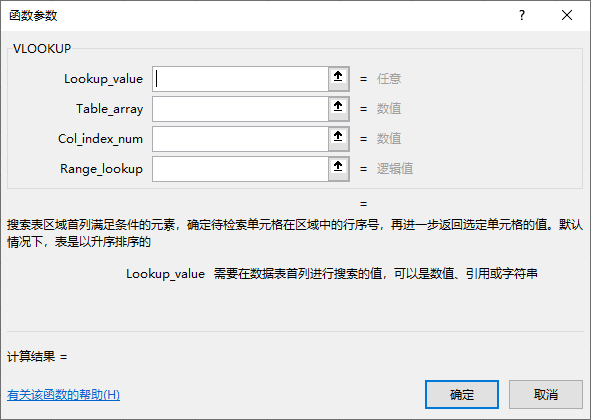
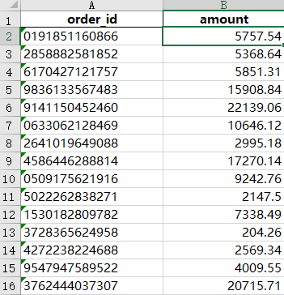
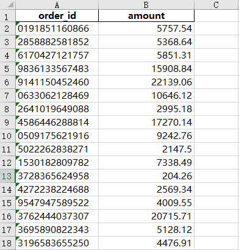
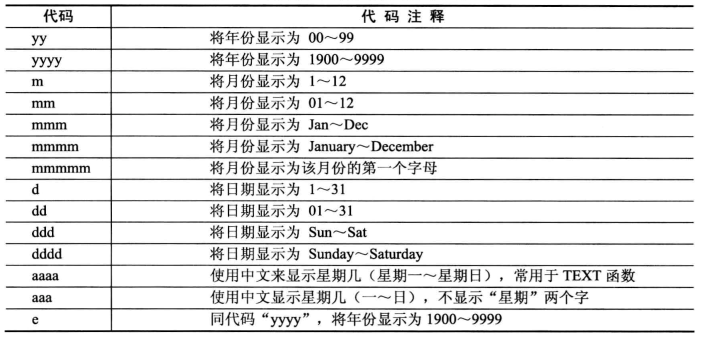
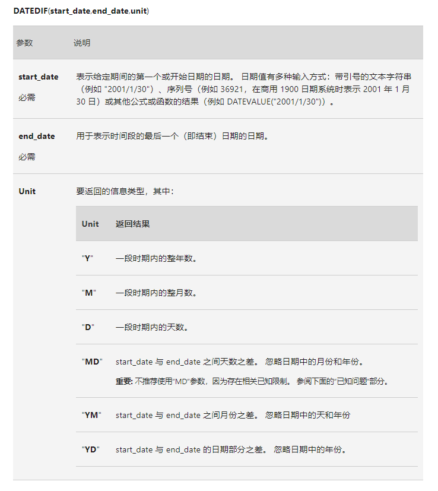

## 3. 百宝箱之公式使用

### 3.1 公式中的函数分类

从工具栏的公式可以看到函数分为以下几类：

* 财务：财务计息、收益率等计算公式。
* 逻辑：逻辑判断`AND OR IF`等。
* 文本：文本字符串处理。
* 日期和时间：时间序列处理。
* 查找和引用：单元格查找和引用。
* 数学和三角函数：数学计算和几何计算。
* 其他函数：统计、工程、多维数据集、信息、兼容性及Web。

### 3.2 Excel公式

#### 3.2.1 组成部分

1. **函数** ：函数名称要使用大写，输入小写会自动转化，并且前面需要加上`=`号，否则将默认为文本
2. **引用**：引用其他单元格的值，例如A1。
3. **常量**：数值或者文本值
4. **运算符**：加减乘除合并等运算符号。

#### 3.2.2 单元格引用

1. 相对引用：

   在公式里引用一个或者多个单元进行计算，引用对用的行和列，例如在单元格`D2`中输入`=B2*C2`表示计算销量乘以

   

2. 绝对引用：

   绝对引用的公式在相对引用的基础上加上`$`符号进行表示，例如`=$B2*C2`为固定B列

   

3. 混合引用：

   

### 3.3 统计计算

常用的统计函数有SUM/AVERAGE/MAX/MIN/COUNT/COUNTA等

#### 值的计算

* 值本数值、逻辑值、文本不参与计算
* 使用位置来计算，则自动会将文本数值转化为数值，但非数值文本则会错误

#### 单条件计算

不含条件直接求和毕竟不在多数，大多数情况下我们需要聚合计算，就是相同条件合并计算在Excel里可以用`SUMIF`，看上去像是`SUM`的增强版。

工作簿`3. 统计计算表.xlsx`中`用户订单`表需要计算不同`class`的销售额汇总，在`单条件计算`工作表中进行操作。`A`列为`class`列，需要计算的值在`B`列，只需要输入公式：

`=SUMIF(用户订单!H$2:H$6001,单条件计算!A2,用户订单!I$2:I$6001)`

第一个参数需要指定条件列，第二参数为条件，第三个参数是需要求和的列，需要注意的是条件列和求和列要一一对应，否则会出现计算的非同一行的值。

#### 多条件计算

多条件计算其实是在单条件的基础上增加多条件，对于多条件求和对应的函数为`SUMIFS`，在`多条件计算`表格里面AB列对应`class`和`gender`两个条件求销售额合计。

### 3.4 查找引用

查找神奇`VLOOKUP`函数，几乎是最常用的函数之一，用于查找列中数据值。

#### 单条件查找

**函数参数**

参数1：要查找的值

参数2：查找区域

参数3：查找返回区域的值

参数4：查找模式

**函数示例**

在`3.4 查找引用.xlsx`文件中的数据表中进行查找，用`A`列的`order_id`查找对应的`amount`值，使用`VLOOKUP`函数在`C2`单元格输入`=VLOOKUP(A2,数据表1!A:H,8,)`回车后公式下拉。第三个参数8代表从A到H列返回第8月的值，最后一个参数可以省略填写。

#### 反向查找

前面的案例是用order_id查找amount的值，需要注意的是使用vlookup返回的值必须位于查找值的右边即往后的列，如果返回值在前面则需要使用反向查找的方式，一种方式是将列的位置调转，但是会影响之前其他以order_id查找的查询，这里使用另一种方式组合公式来实现反向查找。

使用`数据表2`工作表数据，`amount`列位于`order_id`前面，故无法使用`vlookup`函数来进行查找。这里使用组合公式`match+index`，先用match查找列所在位置，再用index直接索引对应的值，在`反向查找`工作表中的`B2`单元格输入`=INDEX(数据表2!A$2:A$6001,MATCH(反向查找!A2,数据表2!B$2:B$6001,))`实现组合公式进行反向查找。

### 3.5 日期计算

#### 构造日期

EXCEL里的`DATE`函数可以通过单元格引用或者输入值生成对应的日期（日期是特殊的数值）

**示例**

在Excel表格里任意一个单元格里面输入`=DATE(2021,1,1)`回车后即可看到`2021/1/1`

#### 格式化日期

在Excel里日期2021年1月12日的标准日期格式为`2021/1/12`，但我们需要10位数的日期`2021-01-12`时就需要对日期格式进行格式化。打开`3.5 日期计算.xlsx`文件使用`TEXT`函数进行处理日期，`C3`单元格是标准日期格式，在`D3`单元格输入`=TEXT(C3,"yyyy-mm-dd")`回车后即可格式化日期。第一个参数是需要格式化的日期，第二个参数则是格式显示的代码，具体日期代码参考一下表格对应。

#### 计算日期相隔

对于两个正确的日期格式，可以使用单元格相减，但得到的值为相隔的天数，如果要获得如年/月等信息，则需要使用`DATEDIF`函数，该函数还支持文本型日期格式。

打开`3.5 日期计算.xlsx`工作簿中`计算日期差`工作表，`B4`和`C4`单元格分别有两个日期，在`D4`单元格计算两日期差。这时候只需要在`D4`单元格输入`=DATEDIF(B4,C4,"D")`回车即可计算出日期差，DATEDIF函数参数如下：

### 

