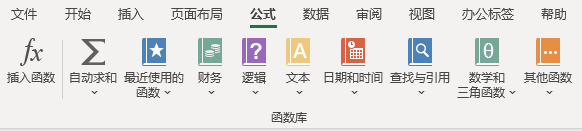
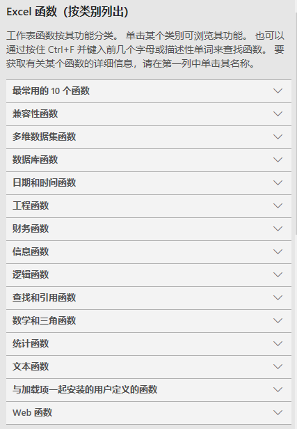

## 3. 百宝箱之函数使用

### 3.1 函数的分类

从工具栏的公式可以看到函数分为以下几类：

* 财务：财务计息、收益率等计算公式。
* 逻辑：逻辑判断`AND OR IF`等。
* 文本：文本字符串处理。
* 日期和时间：时间序列处理。
* 查找和引用：单元格查找和引用。
* 数学和三角函数：数学计算和几何计算。
* 其他函数：统计、工程、多维数据集、信息、兼容性及Web。

### 3.2 函数的基本构成

### 3.3 常用函数使用

* 查找函数
* 

### 3.4 数组公式指南

