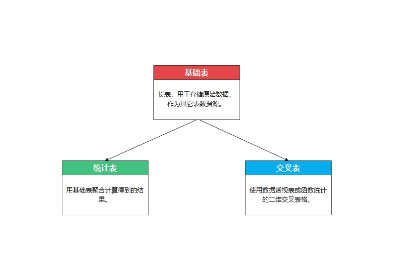
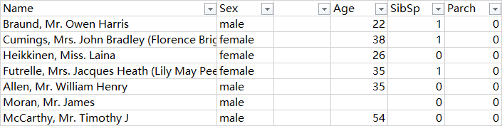
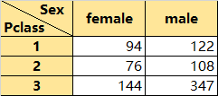

## 3. 三表搞定数据统计

### 3.1 三表框架

三表框架是经过多年学习及实践出来的Excel表格框架，长期使用能养成良好的制表习惯。对数据统计和数据分析来说都是非常好用的技巧。三表框架包括的表格有基础表、统计表以及交叉表。

#### 3.1.1 三表框架组成

### 3.2 基础表

#### 3.2.1 基础表组成

打开`Titanic_train.xlsx`数据表就是标准的基础表，基础标一定是长表数据，且具有以下内容：

* 标题行：数据列标题，作为变量名标识，每一列为单独的数据。
* 数据内容：每一行数据内容，通常叫做样本，也可以称之为个案（case）。

#### 3.2.2 基础表规范

* 标题行中间不能断开，否则Excel自动识别只会到最小连续区域。

* 每列数据内容一致，不要出现数字跟文本混合的情况，除非数据本身需要。
* 文本型数值要转成数值，文本型日期要转成日期（详见第二章）
* 数据行不要出现完全空格的行，也不要出现完全重复的行。
* 最好有个案的ID标识，如`PassengerId`列，可用于数据查找或排序后的重新恢复。

### 3.3 统计表

#### 3.3.1 用公式制作统计表

1. **不同性别的存活率**

   

2. **船舱等级存活率差异**

3. 船舱等级存活率差异

#### 3.3.2 数据透视表的运用

#### 3.3.3 模块化思维

### 3.4 交叉表

交叉表顾名思义就是行列交叉产生的数据表，属于二维数据表格，交叉的地方就是所属的数据内容。例如通过`Pclass`和`Sex`进行交叉计算人数得到的二维表格。

