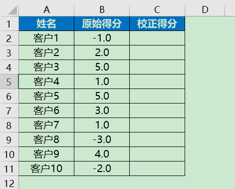
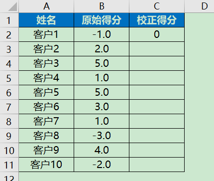
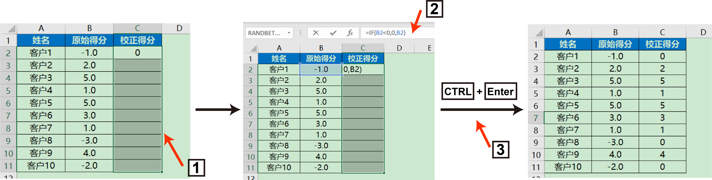
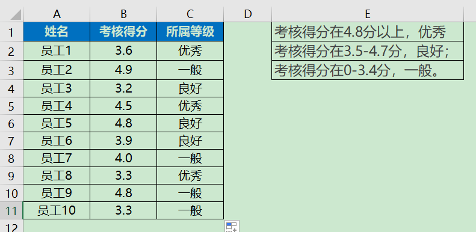

## 5. Excel的函数1

> Excel中有着非常丰富的函数，这些函数能大幅度提升我们的工作效率，本节中会重点介绍一些常用的Excel函数。
>

## 5.1 if函数

打开文件`data/chap5/5.1.xlsx`，点击【案例1】，现在需要对客户的原始得分进行校正，当客户的原始得分为负时，校正为0

针对上面遇到的问题，可以使用IF函数，Excel函数用法如下

【IF函数】**=IF(判断条件，如果满足则，如果不满足则)**

针对遇到的问题，那么在C2单元格中输入

**=IF(B2<0,0,B2)**            ----> **注意，这里的逗号要使用英文的逗号**

那么这个公式是什么意思呢？判断B2单元格是不是小于0，如果是，则C2单元格为0，如果不是则返回B2单元格的值，可以看到C2单元格实际返回值为0，这是因为B2的值为-1，满足判断条件，因此C2单元格返回为0

用鼠标选择C2单元格右下角，当鼠标变成黑色十字，向下拖拽，对剩下的列进行填充

当然你也可以选择另一个更加优雅的方法

1.在C2单元格写Excel公式

2.选择需要填充公式的区域，包括C2单元格

3.点击C2单元格，进入公式编辑状态

4.使用快捷键`CTRL`+`Enter`进行批量填充

## 5.2 if函数与复杂逻辑

打开文件`data/chap5/5.1.xlsx`，点击【案例2】，现在有客户的1月、2月消费金额，如果客户2个月的消费金额都超过400，那么就认为这个客户为高消费客户。

这里与5.1中的案例不同，需要IF函数与逻辑函数进行配合

【AND函数】**=AND(条件1，条件2，...)** 

【OR函数】**=OR(条件，条件2，...)**

AND函数，需要所有条件全部满足，才返还TRUE，OR函数，所有条件中只要有1个条件满足，就返还TRUE

针对遇到的问题，那么在D2单元格中输入

**=IF(AND(B2>400,C2>400),"高消费客户","")**  -----> 这里""代表返回空值

随后对整列的函数进行填充，具体填充方法见5.1中详解

## 5.3 ifs函数

打开文件`data/chap5/5.1.xlsx`，点击【案例3】，有员工的相关考核分，考核得分在4.8分以上，优秀；考核得分在3.5-4.7分，良好；考核得分在0-3.4分，一般。

这里可以使用IFS函数，具体用法为

【IFS函数】=IFS(判断条件1,如果满足条件1则,判断条件2,如果满足条件2则)

针对遇到的问题，则可以在C2单元格输入

**=IFS(B3<=3.4,"一般",AND(B3>=3.5,B3<=4.7),"良好",B3>=4.8,"优秀")**

对整列数据进行函数填充后

## 任务

​	1.选择`data/chap5/5.1.xlsx`工作簿中的【案例1】，将客户原始得分为1以下的校正为0

​	2.选择`data/chap5/5.1.xlsx`工作簿中的【案例2】，客户1月2月中只要有1个月消费超过400，即为"高消费客户"

​	3.选择`data/chap5/5.1.xlsx`工作簿中的【案例3】，能否不使用IFS函数，使用IF函数通过嵌套完成相应的任务。

