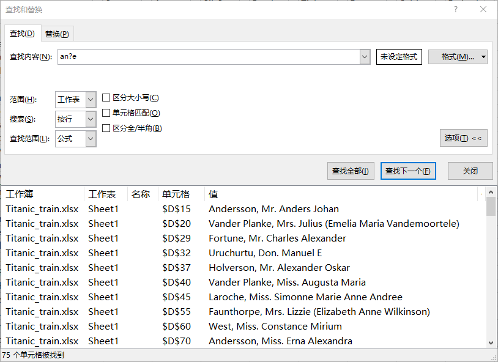

## 6. Excel快捷操作指南

### 6.1 快速定位

通过快速定位可以定位选择常量、公式、空值等单元格。选择工作簿`Titanic_train.xlsx`工作表`Sheet1`的`Age`列，在工具栏：**“开始-编辑-查找与选择-定位条件”**调出定位条件选框，选择`空值`确定选择所有空值，此时如果需要填充空值只需要输入`0`按下回车键即可。

### 6.2 查找与替换

#### 6.2.1 通配符

?（问号）：表示单个字符;

*（星号）：表示任意数量的字符;

~（波浪符）：将问号和星号转换为普通字符，而不是作为通配符使用;

#### 6.2.2 查找

打开工作簿`Titanic_train.xlsx`工作表`Sheet1`

### 6.4 快捷键入门

#### 6.4.4 常用快捷键

| **执行**                                                     | **快捷键**        |
| :----------------------------------------------------------- | :---------------- |
| 选择整个工作表                                               | Ctrl+A            |
| 撤销                                                         | Ctrl+Z            |
| 另存                                                         | F12               |
| 设置单元格格式                                               | Ctrl+1            |
| 加粗                                                         | Ctrl+B            |
| 移到工作表中当前数据区域的边缘                               | Ctrl+箭头键       |
| 输入当前日期。                                               | Ctrl+分号 (;)     |
| 使用“向下填充”命令将选定范围内最顶层单元格的内容和格式复制到下面的单元格中。 | Ctrl+D            |
| 将单元格的选定范围扩展到活动单元格所在列或行中的最后一个非空单元格，或者如果下一个单元格为空，则扩展到下一个非空单元格。 | Ctrl+Shift+箭头键 |

