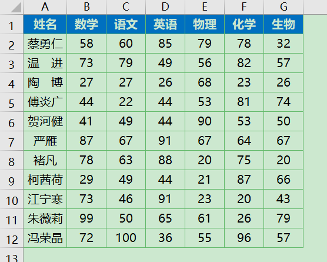
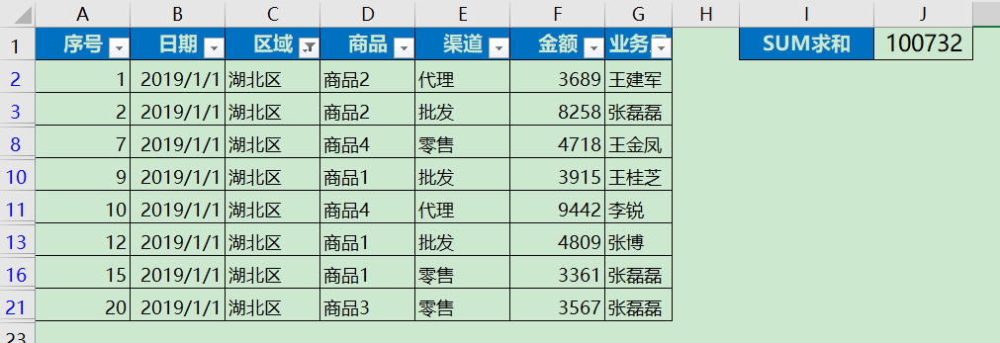

## 7. Excel的函数3

> 在本节中会讲解一些Excel更新的动态函数，从而帮助大家更好的掌握Excel的数据处理与分析

## 7.1 FILTER

> 在工作中，我们需要根据指定的条件，将符合条件的所有记录从数据源表格式查找过来，一是可以用高级筛选。但高级筛选在查询下一个单位时 ，需要重新设置一次，很麻烦。二是用函数公式查询。典型的套路有：INDEX+SMALL+ROW、或者LOOKUP+COUNTIF+OFFSET，而这样的方法对初学者非常不友好，而EXCEL新更新的感受FILTER可以很好的解决这个问题。

【FILTER】函数=FILTER（数据区域，筛选条件，[无满足条件的记录时返回的值]）

接下来就看看FILTER的实际应用案例

### 7.1.1 单条件筛选

打开`data/chap7/7.1xlsx`中的【案例1】

获得湖北区的相关数据

在J2单元格中输入

**=FILTER(A2:G30,C2:C30="湖北区")**    注意数据区域不包含标题

生成的数据的动态数组（WPS由于不兼容动态数组，稍微和Excel有点区别，会产生数据溢出的情况）

### 7.1.2 返回选定的列

打开`data/chap7/7.1xlsx`中的【案例1】

如果在实际的任务中不需要所有的列，只需要其中的几行，那么应该怎么操作？

可以在K2单元格中输入

**=FILTER(F2:G30,C2:C30="湖北区")**

细心的同学就发现了这里与7.1.1中的不同，如果需要返回其中的几行，只需要将数据区域修改为自己需要的区域即可

现在需要知道湖北区的最大销售金额是多少

**=MAX(FILTER(F2:F30,C2:C30="湖北区"))**

### 7.1.3 多条件筛选

打开`data/chap7/7.1xlsx`中的【案例1】

FILTER函数中的多条件筛选，使用`+`来表示或，使用`*`表示且

例如，需要计算湖北区、湖南区大最大销售金额，那么函数公式为

**=MAX(FILTER(F2:F30,(C2:C30="湖北区")+(C2:C30="湖南区")))**

例如，需要计算湖北区商品2的最大销售金额，那么函数公式为

**=MAX(FILTER(F2:F30,(C2:C30="湖北区")*(D2:D30="商品2")))**

## 7.2 SUMIF函数

>  在Excel数据任务处理中，会遇到大量的求和的任务，SUMIF函数在求和任务中具有天然优势，因此在本节中将详细的讲解SUMIF函数的相关用法

【SUMIF函数】=SUMIF(条件区域，求和条件，[实际求和区域])  --->实际求和区域位选择条件

### 7.2.1 案例1

打开`data/chap7/7.2xlsx`中的【案例1】

现在有几名同学的考试成绩，现在想统计数学成绩在90分以上的成绩之和

那么可以输入如下的函数公式

**=SUMIF(B:B,">=90",B:B)**

第一个参数为条件区域，因为要判断数学成绩，所以这里选择B列，当然这里也可以修改为实际的区域B2:B12

第二个参数为判定条件，判定条件为大于等于90

第三个参数为实际求和区，这是选填参数

### 7.2.2 案例2

打开`data/chap7/7.2xlsx`中的【案例2】

现在想统计小米系列的产品销售额是多少？

SUMIF函数支持模糊匹配，因此我们输入如下公式

**=SUMIF(B:B,"小米*",C:C)**

使用小米*匹配所有的小米系产品

### 7.2.3 案例3

打开`data/chap7/7.2xlsx`中的【案例3】

现在想统计1月-3月的预计销售额预计销售和实际销售额

因此可以巧用SUMIF函数，将条件区域进行横向选择，条件选择自己需要的字段，因此输入如下两个函数公式，并向下拖拽填充其他位置

`=SUMIF($B$2:$G$2,I$2,B3:G3)`

`=SUMIF($B$2:$G$2,H$2,B3:G3)`

`$`在Excel中是绝对引用，公式中引用的单元格如果使用绝对引用 `$`，那么向下拖拽的过程中，这个单元格不会增加。

例如，在J3单元格中输入`=C3`，在K3单元格中输入`=$C$3`并向下拖拽进行公式填充，观察区别

发现，如果使用绝对引用，引用格式值并不会随着公式的拖拽而改变，这就是绝对引用与非绝对引用的区别。

### 7.2.4 案例4

打开`data/chap7/7.2xlsx`中的【案例4】，现在需要统计语文成绩在80分以上，90分以下同学的数学成绩之和

那么遇到这种情况应该怎么处理呢？相比于前面的案例，这里有2个筛选条件，而SUMIF函数无法满足需求，这里可以使用SUMIFS函数

【SUMIFS函数】=SUMIFS（实际求和区域，条件区域1，条件1，条件区域2，条件2）

因此写如下函数公式

**=SUMIFS(C2:C13,B2:B13,">80",B2:B13,"<90")**

因为要求数学成绩，所以第一个参数为C2:C13，而筛选条件为语文，因此条件区域为B2:B13

## 7.3 SUBTOTAL函数

Excel中有数据筛选非常好用，那么，如果想统计筛选后的结果应该怎么弄？例如想知道筛选后的销售总额

打开`data/chap7/7.3xlsx`中的案例1，使用筛选选择不同的区，而SUM求和并没有变化

如果想实现上述需求，可以使用【SUBTOTAL函数】

【SUBTOTAL函数】=SUBTOTAL(功能函数,选择区域)

功能函数

数字 1-11 或 101-111，用于指定要为分类汇总使用的函数。 如果使用 1-11，将包括手动隐藏的行，如果使用 101-111，则排除手动隐藏的行；始终排除已筛选掉的单元格。详见附件1

在J2单元格中输入如下公式

**=SUBTOTAL(9,F2:F21)**

可以看到SUBTOTAL对筛选的数据列进行正确的求和，而SUM无法跟随选择的数据列进行正确求和

【附件1】

| **Function_num(包括隐藏的行)** | **Function_num**(忽略隐藏的行) | 函数    |
| ------------------------------ | ------------------------------ | ------- |
| 1                              | 101                            | AVERAGE |
| 2                              | 102                            | COUNT   |
| 3                              | 103                            | COUNTA  |
| 4                              | 104                            | MAX     |
| 5                              | 105                            | MIN     |
| 6                              | 106                            | PRODUCT |
| 7                              | 107                            | STDEV.S |
| 8                              | 108                            | STDEV.P |
| 9                              | 109                            | SUM     |
| 10                             | 110                            | VAR.S   |
| 11                             | 111                            | VAR.P   |

## 任务

​	1.打开`data/chap7/7.1xlsx`中的【案例1】计算河北区中商品1的最小销售额

​	2.打开`data/chap7/7.1xlsx`中的【案例1】计算湖北中什么渠道下的什么商品具有最高销售额

​	3.打开`data/chap7/7.2xlsx`中的【案例1】语文成绩在80分以上的同学成绩之和

​	4.打开`data/chap7/7.2xlsx`中的【案例2】统计所有苹果系列产品的销售额

​	5.打开`data/chap7/7.2xlsx`中的【案例5】完成所有手机的销售额求和
