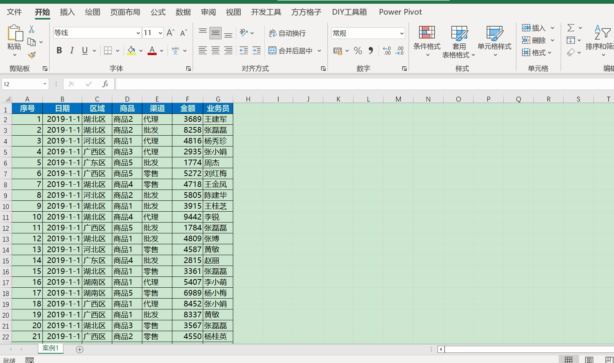

.. _header-n98:

第七章 Excel函数-动态函数
=========================

   在本节中会讲解一些Excel更新的动态函数，从而帮助大家更好的掌握Excel的数据处理与分析

.. _header-n102:

1.FILTER函数
------------

   在工作中，我们需要根据指定的条件，将符合条件的所有记录从数据源表格式查找过来，一是可以用高级筛选。但高级筛选在查询下一个单位时
   ，需要重新设置一次，很麻烦。二是用函数公式查询。典型的套路有：INDEX+SMALL+ROW、或者LOOKUP+COUNTIF+OFFSET，而这样的方法对初学者非常不友好，而EXCEL新更新的感受FILTER可以很好的解决这个问题。

【FILTER】函数=FILTER（数据区域，筛选条件，[无满足条件的记录时返回的值]）

接下来就看看FILTER的实际应用案例

.. _header-n107:

案例1
~~~~~

打开\ ``data/chap7/7.1xlsx``\ 中的【案例1】

获得湖北区的相关数据

在J2单元格中输入

**=FILTER(A2:G30,C2:C30="湖北区")** 注意数据区域不包含标题

生成的数据的动态数组（WPS由于不兼容动态数组，稍微和Excel有点区别，会产生数据溢出的情况）

.. _header-n114:

案例2
~~~~~

打开\ ``data/chap7/7.1xlsx``\ 中的【案例1】

如果在实际的任务中不需要所有的列，只需要其中的几行，那么应该怎么操作？

可以在K2单元格中输入

**=FILTER(F2:G30,C2:C30="湖北区")**

细心的同学就发现了这里与7.1.1中的不同，如果需要返回其中的几行，只需要将数据区域修改为自己需要的区域即可

现在需要知道湖北区的最大销售金额是多少

**=MAX(FILTER(F2:F30,C2:C30="湖北区"))**

.. _header-n123:

案例3
~~~~~

打开\ ``data/chap7/7.1xlsx``\ 中的【案例1】

FILTER函数中的多条件筛选，使用\ ``+``\ 来表示或，使用\ ``*``\ 表示且

例如，需要计算湖北区、湖南区大最大销售金额，那么函数公式为

**=MAX(FILTER(F2:F30,(C2:C30="湖北区")+(C2:C30="湖南区")))**

例如，需要计算湖北区商品2的最大销售金额，那么函数公式为

**=MAX(FILTER(F2:F30,(C2:C30="湖北区")*(D2:D30="商品2")))**

.. _header-n132:

2.SUBTOTAL函数
--------------

Excel中有数据筛选非常好用，那么，如果想统计筛选后的结果应该怎么弄？例如想知道筛选后的销售总额

打开\ ``data/chap7/7.2xlsx``\ 中的案例1，使用筛选选择不同的区，而SUM求和并没有变化

如果想实现上述需求，可以使用【SUBTOTAL函数】

【SUBTOTAL函数】=SUBTOTAL(功能函数,选择区域)

功能函数

数字 1-11 或 101-111，用于指定要为分类汇总使用的函数。 如果使用
1-11，将包括手动隐藏的行，如果使用
101-111，则排除手动隐藏的行；始终排除已筛选掉的单元格。详见附件1

在J2单元格中输入如下公式

**=SUBTOTAL(9,F2:F21)**

可以看到SUBTOTAL对筛选的数据列进行正确的求和，而SUM无法跟随选择的数据列进行正确求和

.. figure:: ../_static/chap7/7.5.gif
   :alt: 

【附件1】

练习
----
1.打开\ ``data/chap7/7.1xlsx``\ 中的【案例1】计算河北区中商品1的最小销售额

2.打开\ ``data/chap7/7.1xlsx``\ 中的【案例1】计算湖北中什么渠道下的什么商品具有最高销售额
