## 10. Excel看板

> 数据看板作为数据动态展示的一种重要方式，被广泛的应用于各个领域，因此本节根据1个案例讲解使用Excel制作数据看板的过程，以期起到抛砖引玉的效果，在学习技能的同时也将其应用到实践的工作中

## 1.业务背景

打开`data/chap10/10.1.xlsx`中的数据源，这是某厂家在淘宝、拼多多、京东这3个电商销售平台的销售数据，现在你是这个厂家的员工，老板想知道商品在不同渠道的每周销售情况，想请你做一个数据周报看板。

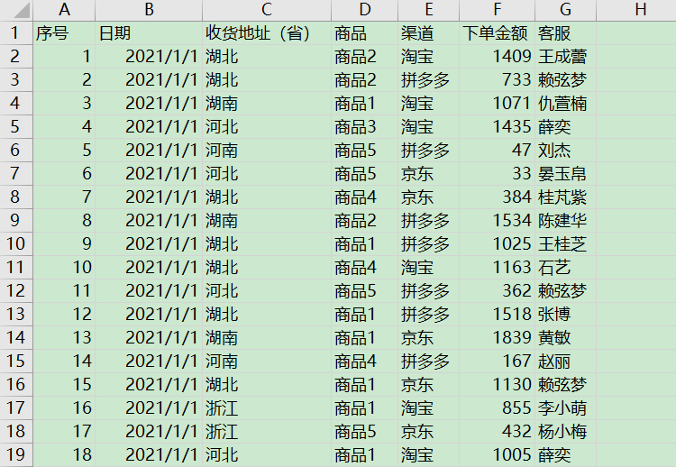

## 2.实现分析

1.既然是周报看板，需要确定每天日期所在周数与每周的第几天

2.根据确定周数对销售金额进行汇总

3.对销售金额进行动态展示

## 3.实现过程

### **1.**确定周数

确定日期所在的周数用【WEEKNUM函数】，确定日期是第几周可以用【WEEKDAY函数】

在H2单元格输入 **=WEEKNUM(B2,2)**

在I2单元格输入 **=WEEKDAY(B2,11)**    （如果想得到中文星期几  可以输入 =TEXT(B2,"aaaa")）

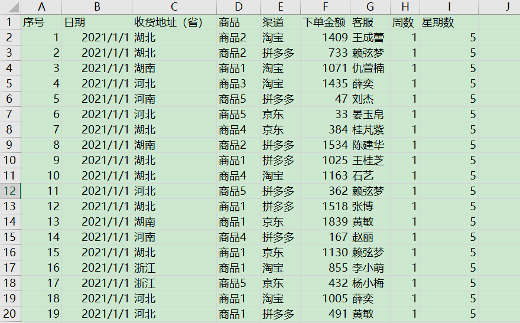

### **2.销售基础整理**

新建1个工作表，确定动态数据的变量为周数，并确定需要计算的指标，本周开始日期、介绍日期、销售额、订单数、上周销售额、上周订单数、销售额变化、订单数变化

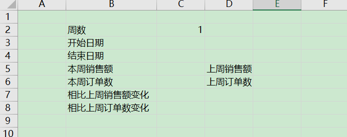

使用公式求解相关的基础数据

在C3单元格输入公式`=XLOOKUP(C2,数据源!H1:H50001,数据源!B1:B50001)`

如果发现数据日期变成了44200，显然就是格式不正确，只需要将单元格的格式转为日期即可

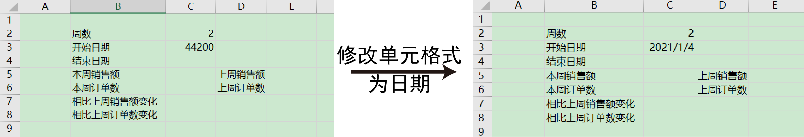

在C4单元格输入公式`=XLOOKUP(C2,数据源!H1:H50001,数据源!B1:B50001,0,0,-1)`

对于本周的销售额，可以使用SUMIFS函数获得 ，在C5单元格中输入

`=SUMIFS(数据源!$F:$F,数据源!$B:$B,">="&$C$3,数据源!$B:$B,"<="&$C$4)`

对于本周的订单数，可以使用COUNTIFS函数获得 ，在C6单元格中输入

`=COUNTIFS(数据源!$B:$B,">="&$C$3,数据源!$B:$B,"<="&$C$4)`

对于上周开始日期，可以使用本周开始日期-7，在E3单元格中输入

`=C3-7`

对于上周结束日期，可以使用本周结束日期-7，在E4单元格中输入

`=C4-7`

对于上周销售额，可以使用SUMIFS函数获得 ，在E5单元格中输入

`=SUMIFS(数据源!$F:$F,数据源!$B:$B,">="&$E$3,数据源!$B:$B,"<="&$E$4)`

对于上周的订单数，可以使用COUNTIFS函数获得 ，在E6单元格中输入

`=COUNTIFS(数据源!$B:$B,">="&$E$3,数据源!$B:$B,"<="&$E$4)`

对于相比上周销售额变化，可以使用百分比计算，使用【TEXT函数】确定格式，在C7单元格中输入

`=TEXT(((C5-E5)/E5)*100,"0.00")&"%"`

对于相比上周订单数变化，可以使用百分比计算，使用【TEXT函数】确定格式，在C8单元格中输入

`=TEXT(((C6-E6)/E6)*100,"0.00")&"%"`

当然也可以直接设置单元格格式为【百分比】

当然这个【相比上周销售额变化】指标是一个比较重要的指标，可以对这个指标进行格式设置

选择C6单元格并设置条件格式，判断C5单元格与E5单元格值的大小，如果C5>=E5，那么C6单元值为红，否则为绿色

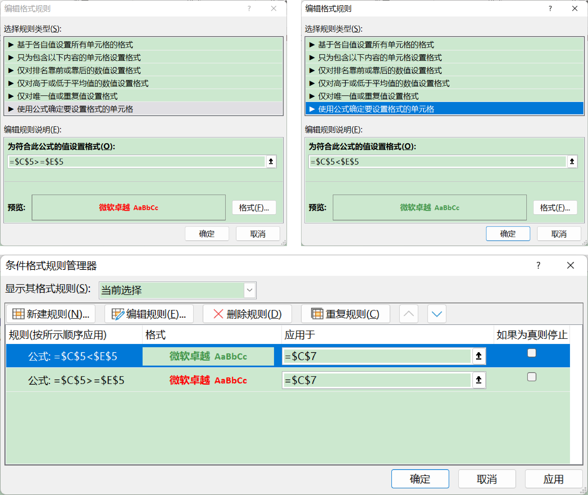

### **3.周销售数据变化趋势**

对于每周的数据需要做一个统计，并对每周数据的下单金额与下单数进行整理

装B13-B19单元格输入星期数

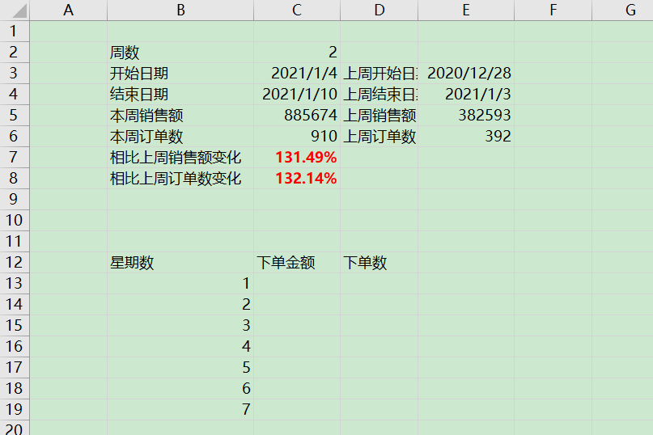

现在需要统计每周1-7的下单金额，因此在C13单元格中输入公式，并向下填充公式

`=SUMIFS(数据源!$F:$F,数据源!$B:$B,">="&$C$3,数据源!$B:$B,"<="&$C$4,数据源!$I:$I,"="&计算过程!B13)`

现在需要统计每周1-7的下单金额，因此在C13单元格中输入公式，并向下填充公式

`=COUNTIFS(数据源!$B:$B,">="&$C$3,数据源!$B:$B,"<="&$C$4,数据源!$I:$I,"="&计算过程!B13)`

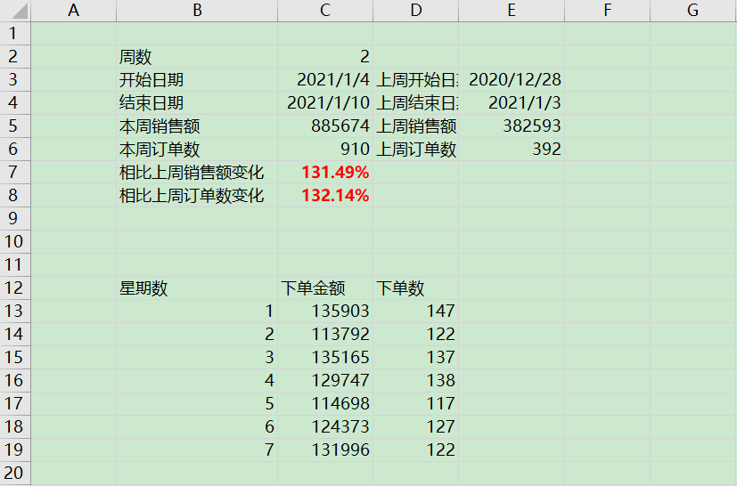

接下来就对数据进行可视化展示

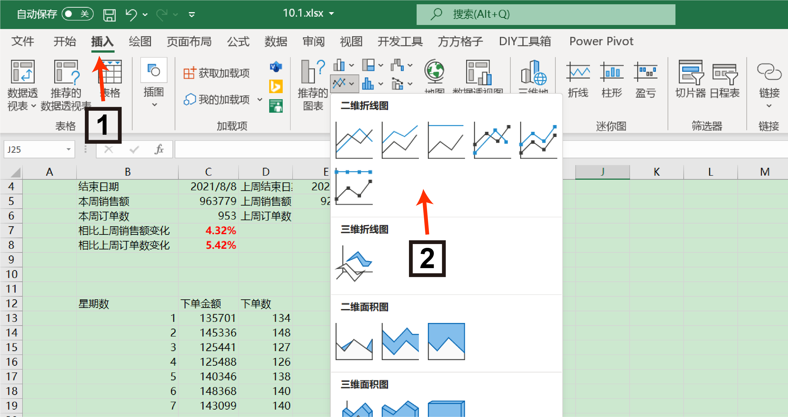

将图片进行简单的美化，就可以得到下单金额与下单数的变化趋势图

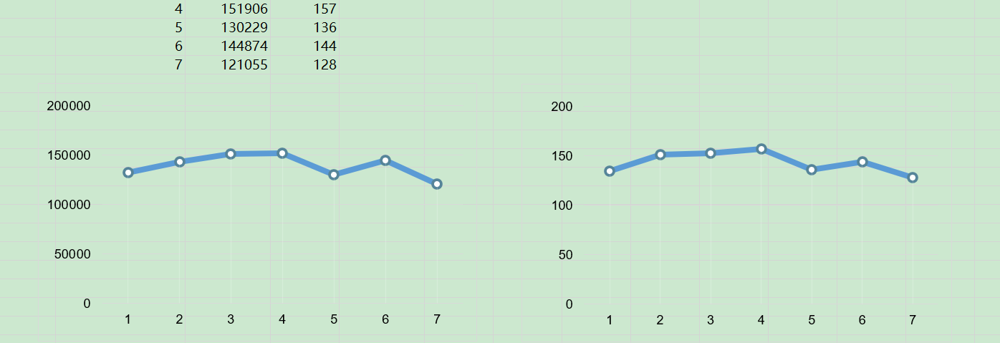

### **4.周销售渠道整理**

对于每周的数据需要做一个统计，并对每周数据的渠道分布进行整理

装G3-G6单元格分别输入产品的电商渠道京东、拼多多、淘宝

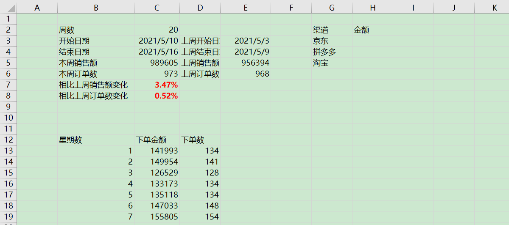

在H3单元格中输入SUMIFS函数求不同渠道的销售金额，并进行向下填充

`=SUMIFS(数据源!$F:$F,数据源!$E:$E,G3,数据源!$B:$B,">="&$C$3,数据源!$B:$B,"<="&$C$4)`

在I3单元格中输入COUNTIF函数求不同渠道的下单数，并进行向下填充

`=COUNTIFS(数据源!$E:$E,G3,数据源!$B:$B,">="&$C$3,数据源!$B:$B,"<="&$C$4)`

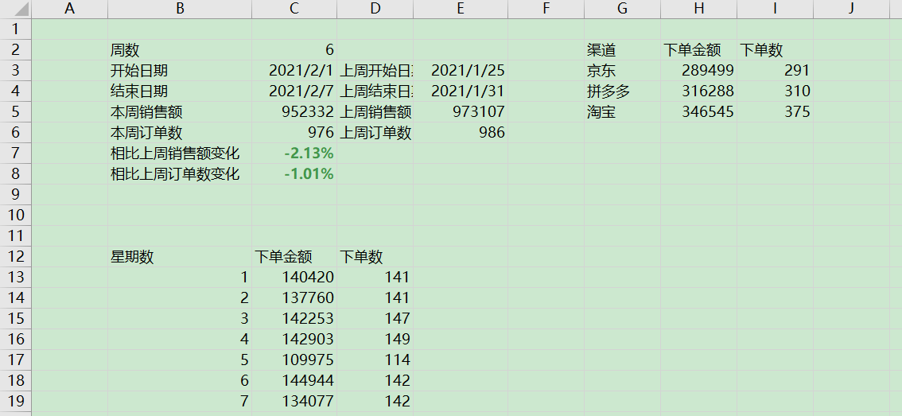

接下来就对数据进行可视化展示，将图片进行简单的美化，就可以得到下单金额饼状图与下单数的柱状图

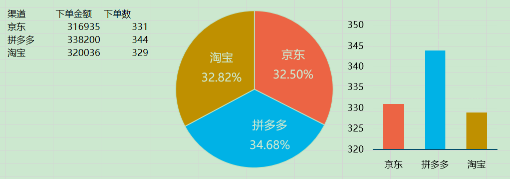

### **5.看板绘制**

完成了前面的全部计算后，接下来的工作就是将绘制的图结合在一起进行展示

首先是上述计算的数据与绘图的信息集合到一起

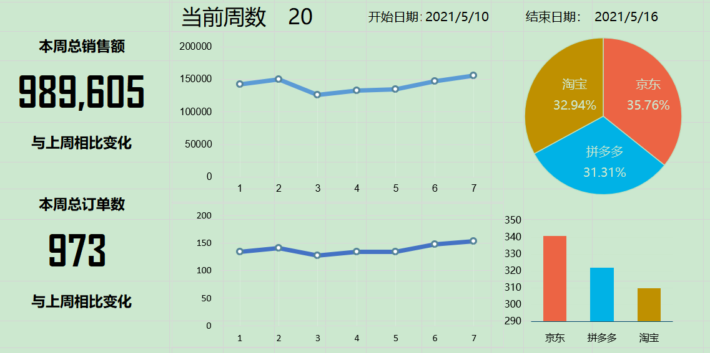

其中本周的总销量、本周订单数、当前周数、开始日期以及结束日期都是引用计算过程中的值

本周总销量的值为`=计算过程!$C$5`

本周总订单的值为`=计算过程!$C$6`

本周周数的值为`=计算过程!$C$2`

本周的开始日期为`=计算过程!$C$3`

本周的结束日期为`=计算过程!$C$4`

因为本周的变化情况带有条件单元格式，因此不能直接引用，需要将其转化成链接图片的形式，具体操作为

1.复制C7单元格

2.粘贴选择链接的图片

对于本周的周数，需要设置按钮方便调节

1.选择开发工具

2.选择插入，选择数值调节按钮

3.选择设置控件格式

4.设置控件的对应参数

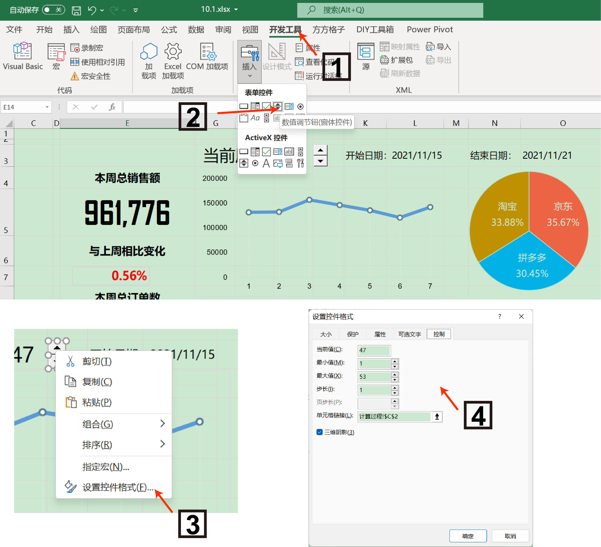

到这里就完成了看板90%的步骤，点击按钮，能看动态展示看板的相关数据

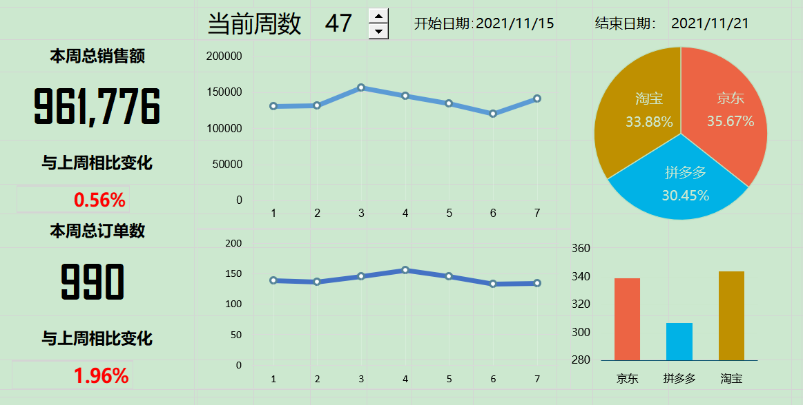

最后就对看板进行相应的美化，在看板美化过程中也参考了其他EXCEL教程中的配色，因此最后的看板展示效果为

## 思考

​	1.为什么每周的介绍日期和开始日期都可以使用XLOOKUP获得

​	2.为什么每周1的下单金额之和可以通过SUMIF函数求

​	3.为什么设置按钮调节每周的数据变化，这样有什么好处

## 后记

> 行文至此，以上就是Free-excel教程的全部内容，整个教程的编写过程中也广泛的参阅了各式各样的Excel教程，尽力让本教程变得轻松易学，希望读者能掌握相关的Excel技巧，并能灵活的运用到工作中，面对数字化社会，数据将渗透到生活的点点滴滴，拥抱数字，同时也拥抱变化。
>
> --作者：牧小熊，Datawhale成员，数据分析师
