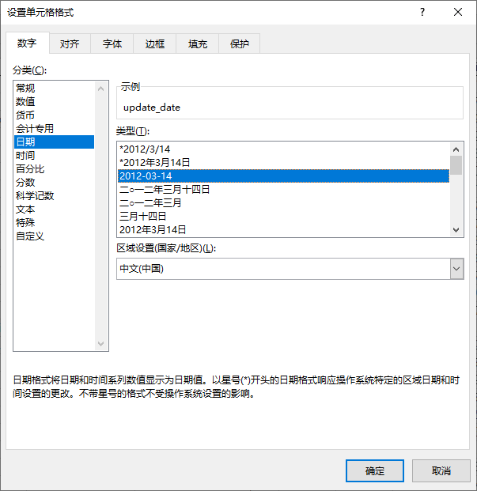

## 2. 表格所见非所得

> 在本节中我们将了解Excel中的各种单元格格式，并讲解了不同格式之间的转化

### 2.1 单元格数据类型

打开`data/chap2/2.1.xlsx`文件，点击案例4工作表，可以看到Excel有11种数据类型

接下来会主要讲解3种常用的数据类型

#### 2.1.1 数字

数值是单元格最常见的数据之一，12位数的时候会以科学计数法显示。

下图展示的是真假数值列，真数值默认情况下是右对齐（方便观测数据位数），假数值是数值型文本属于**文本**，左上角会有个绿色三角错误检查，当数据是文本时，无法完成数字运算操作。

Excel会自带数据纠错功能，点击黄色感叹号可以看到，将文本转出数字，或者使用`=VALUE()`函数将文本转成数字

#### 2.1.2 文本

文本为Excel中的常见格式，主要为文本字符串，例如下图就是典型的文本数据。当数据是文本类型时就可以完成文本数据相关操作。

#### 2.1.3 日期

Excel中的标准日期由年月日组成的数据，例如`2021/1/1`，同时日期又是很特殊的数值，在Excel里面日期最早是1900年1月1日，对应的数值为1，通过两日期相减可以得到日期相差的天数。需要注意的是如果是`2021-01-01`的数据就要看是否实际数据为`'2021/1/1'`，否则为文本型日期，需要进行转换才行。观察下图真假日期，可以发现真日期右对齐，假日期左对齐（内容跟显示的一致），真日期转格式可以看到单元格数据仍然是真日期格式（内容跟显示不一致）。

### 2.2 单元格格式

#### 2.2.1 设置单元格格式

设置单元格格式可以点击单元格后，**右键-设置单元格格式**选项，或者按快捷键**ctrl+1**，或者通过工具栏：**开始-数字**去快速做更改。单元格可以设置的格式类型包括：

* 数字：调整数值格式或者日期格式。
* 对齐：调整对齐方式。
* 字体：更改字体、字型、字号等。
* 边框：单元格边框设置。
* 填充：填充单元格背景颜色，标注数据经常使用。
* 保护：锁定单元格或者隐藏公式。

#### 2.2.2 数值格式

设置单元格格式分类选择数值，对数值设置小数点一般保留两位，同时能让数值对齐，使用千分位分隔符能更容易观察数值大小。

#### 2.2.3 文本格式

文本常见的设置格式用于对文本进行加单引号、双引号或者逗号的情况。以`user_orders.xlsx`文件为例，对`email`列进行添加单引号的操作。

首先选择`email`列，调出设置单元格格式，分类选择``自定义``，找到`@`后在外面加上单引号。

#### 2.2.4 日期格式

通过日期分类调整日期格式为年-月-日，需要注意的是文本型的日期格式无法调整，而数值是可以调整为日期。

### 2.3 转换单元格数据

通过数据工具的`分列`功能能够巧妙的将数据进行转换，以下将使用`user_orders`表为例进行操作。

#### 2.3.1 数值和文本相互转换

将`数值型文本`转为`数值`，选择`order_id`列并使选择分列功能，默认下一步直至完成。

#### 2.3.2 日期和文本相互转换

将`文本日期`转换为`日期`，选择`update_date`列并选择`分列`功能，到第三步的时候选择`日期`点击完成。

### 任务

1. 将`data/chap1/Titanic_train`工作簿中的`Pclass`列的数值转文本
2. 完成`data/chap2/2.1.xlsx`中案例1-3中的问题
3. 完成`data/chap2/2.2.xlsx`中案例1-2中的问题
