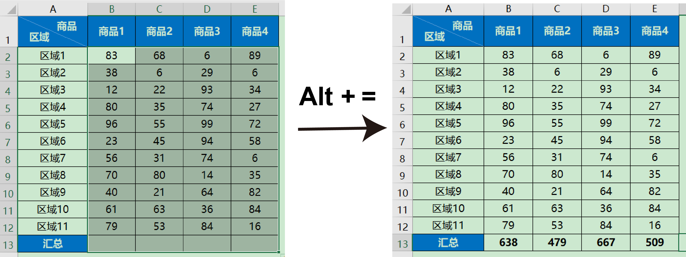
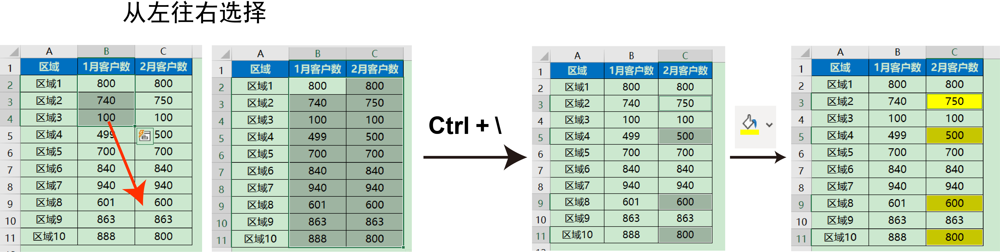
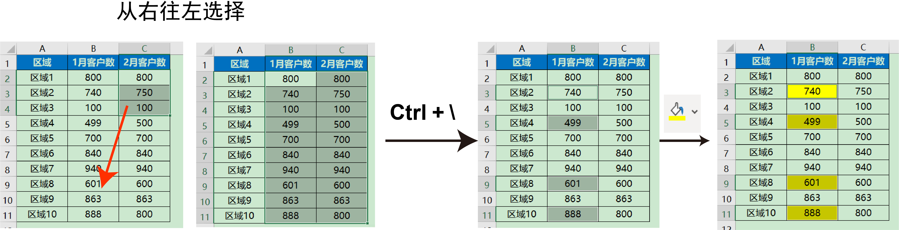
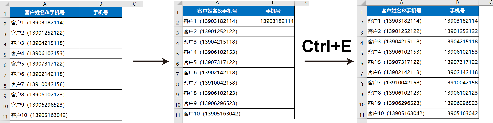
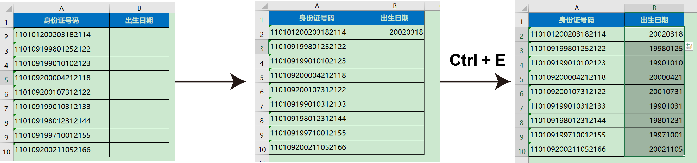

## 3. Excel的快捷操作

> 在本节中我们将了解Excel中的各种快捷操作，目前已知的Excel快捷操作键有230个，本篇重点介绍那些常用的Excel快捷操作键。
>
> 由于编者的水平限制，如果有一些其他好用的Excel快捷键，在本篇中没有介绍的，请联系我们。

## 3.1快捷键简介

### 3.1.1 文件相关

- `Ctrl` + `N`     创建一个新的Excel工作簿 
- `Ctrl` + `w`     关闭当前工作簿
- `Ctrl` + `S`     保存当前的Excel工作簿
- `F12`               将当前文件进行另存为
- `Ctrl` + `p`     打印当前工作表

### 3.1.2 通用快捷键

- `Ctrl` + `z`    撤销当前操作
- `Ctrl` + `Y`     恢复撤销，可以用这个快捷键恢复被撤消的操作 
- `Ctrl` + `C`     复制所选单元格
- `Ctrl` + `x`     剪切所选单元格
- `Ctrl` + `v`     粘贴所选单元格
- `Ctrl` + `F`     弹出查找和替换对话框 
- `Ctrl` + `G`     显示定位对话框

### 3.1.3 表格选择

- `Ctrl` + `A`     全选表格
- `Ctrl` + `→`    移动到数据区域的右边缘
- `Ctrl` + `←`    移动到数据区域的左边缘
- `Ctrl` + `↑`    移动到数据区域的上边缘
- `Ctrl` + `↓`    移动到数据区域的下边缘 

### 3.1.4 单元格编辑

- `F2`                             编辑当前单元格（跟双击单元格效果一致） 
- `Alt` + `Enter`          在当前单元格内换行 (直接按 `Enter`会跳转到下一行)

- `Enter`                      下移一个单元格 
- `Shift` + `Enter`       上移一个单元格  
- `Tab`                           右移一个单元格 
- `Shift` + `Tab`            左移一个单元格 
- `Ctrl` + `Enter`          输入完成，并停留在当前单元格 
- `Ctrl` + `;`（分号）    输入当前日期（显示为年/月/日）
- `Ctrl` +` Shift` + `: `    输入当前时间 (显示为小时/分钟)
- `Ctrl` + `E`                   快速填充 

### 3.1.5 Excel格式化

- `Ctrl` + `1`（数字1）   设置单元格格式
- `Ctrl` + `B`                    加粗或取消加粗
- `Ctrl` + `i`                     加斜体或取消斜体 

### 3.1.6 Excel公式

- `F4`              绝对引用和相对引用切换
- `Alt`+`=`      自动插入求和公式

## 3.2 Excel快捷键实践

### 3.2.1 自动插入求和公式

打开文件`data/chap3/3.1.xlsx`，点击【案例1】，

1.选中案例1中的表格区域（**注意这里要把汇总的那一行也选上**）

2.使用快捷键`Alt`+`=` ，自动插入求和公式，可以看到，对上述的Excel表格区域进行自动求和。

### 3.2.2 自动进行列差异比对

打开文件`data/chap3/3.2.xlsx`，点击【案例1】，我们现在的任务是找到1月和2月客户数不同的区域，如何快速定位？

1.选中需要进行列差异比对的区域，注意选择顺序从左往右

2.使用快捷键`ctrl`+`\` (**注意是“\”不是"/"**)，可以快速定位到区域4、区域8以及区域10所对应的客户数不同

3.选择填充颜色，即可快速显示两列的差异

**思考：**

如果需要定位到1月客户数怎么办？

注意这里的选择方向，从右往左选择，那么默认最右边为参考标准，其他列的数据可参考标准比较，如果从左往右选择，那最左边就是参考标准，其他的操作同上

### 3.2.3 自动填充

在excel中很多重复、繁琐的工作由数据提取和数据合并这类问题造成，**2013年以后的Excel**支持智能填充，能灵活的解决这类问题。

打开文件`data/chap3/3.3.xlsx`，点击【案例1】，需要提取客户的手机号

1.手动提取客户1的手机号，并输入到【B2】

2.选择需要快速填充的列，也就是【B2-B11】

3.按`ctrl`+`E`进行自动填充

打开文件`data/chap3/3.3.xlsx`，点击【案例2】，需要从身份证号码中提取出生日期

1.手动出生日期，并输入到【B2】

2.选择需要快速填充的列，也就是【B2-B11】

3.按`ctrl`+`E`进行自动填充

## 任务

​	1.完成`data/chap3/3.1.xlsx`工作簿中的【案例2】【案例3】的快捷键自动求和任务

​	2.完成`data/chap3/3.2.xlsx`工作簿中的【案例2】【案例3】的多行快速比对任务（提示：需要选中所有待比对表格框）

​	3.完成`data/chap3/3.3.xlsx`工作簿中的【案例3】【案例4】的多行快速比对任务（提示：需要选中所有待比对表格框）
