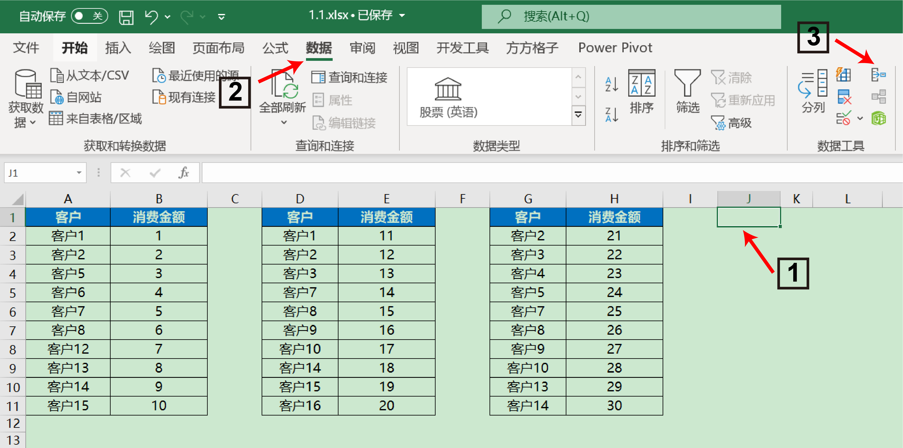
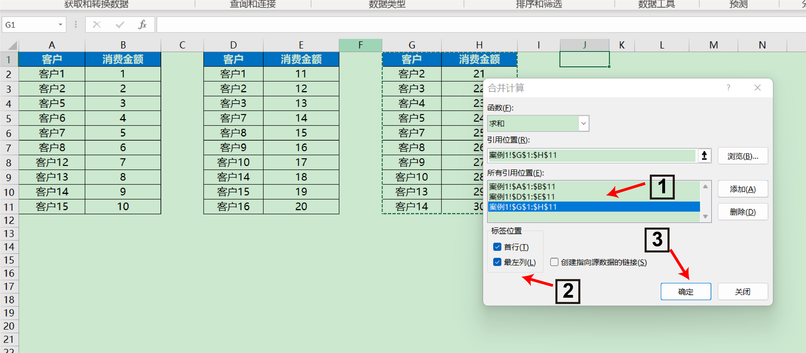
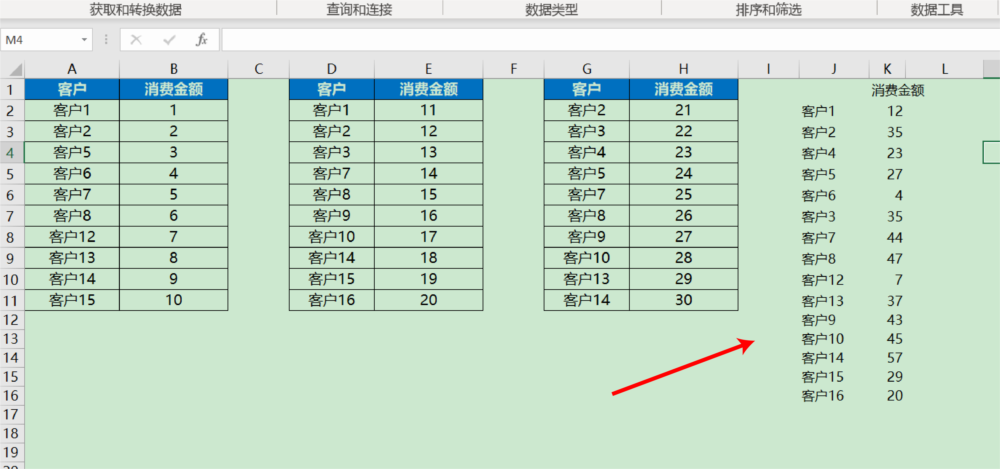
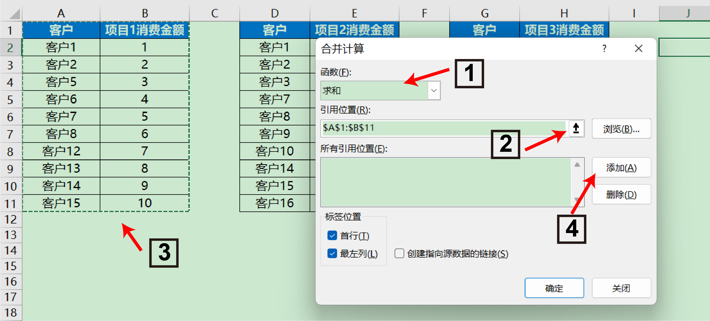
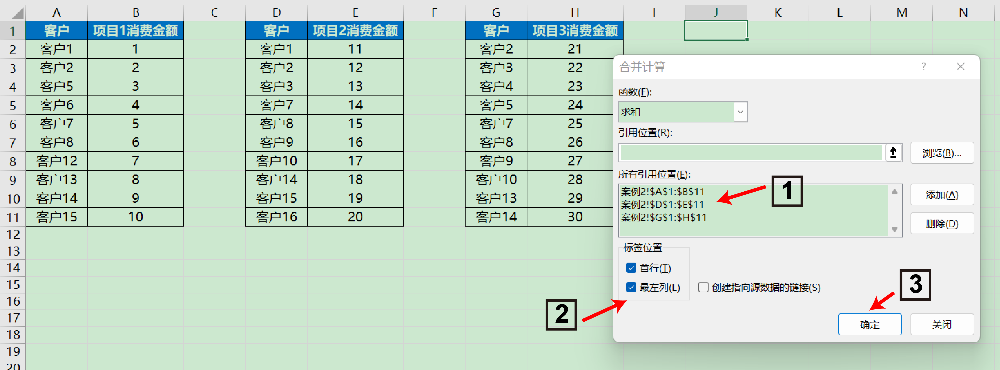
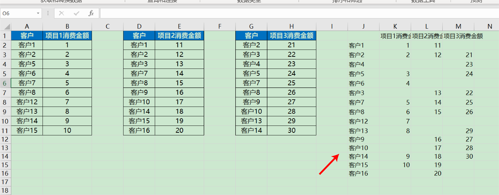

## 4. Excel的表合并

> 当遇到需要将多个表的行记录合并在一起的时候，我们一般会手动复制粘贴，这会带来很多重复繁琐的操作，并且容易出错，可以使用Excel的合并计算工具来快速完成。
>

## 4.1多表行合并

打开文件`data/chap4/4.1.xlsx`，点击【案例1】可以看到有3个消费表格，每个客户的消费金额不同，现在需要你统计每个客户在消费的总金额。

一般的操作方法是将这3个数据复制粘贴，那么有没有更加优雅的方法呢？这里推荐使用合并计算

**1.选择需要汇总的单元格起点**

**2.选择Excel中的数据栏**

**3.找到数据栏中的合并计算块**

**4.选择合并计算函数中的求和**

**5.点击引用位置右侧的引用项**

**6.选择第一个数据表所在的范围**

**7.点击添加**

**8.将3个数据表添加到所有引用位置**

**9.选择标签位置信息**

**10.点击完成**

可以看到完成了所有客户消费金额的求和计算~

## 4.2多表列合并

打开文件`data/chap4/4.1.xlsx`，点击【案例2】可以看到有3个不同的消费表格，每个客户的消费金额不同，现在需要你统计每个客户在3个不同消费的总金额。

与4.1的操作类型，使用合并计算选择3个不同项目的数据区域

## 任务

​	1.选择`data/chap3/4.1.xlsx`工作簿中的【案例1】得到不同客户的消费次数

​	2.选择`data/chap3/4.1.xlsx`工作簿中的【案例2】得到不同客户的不同项目的消费次数
